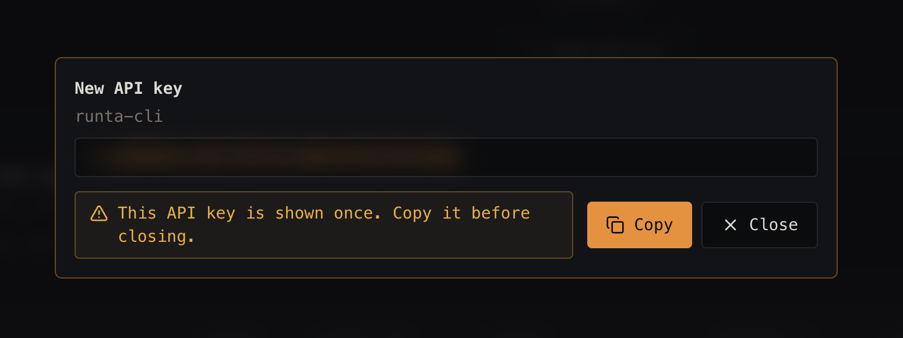

# Audit 04 — Modals: layout and spacing (New API key)

**Date:** 2026-09-25
**Surface:** "New API key" modal (dashboard)
**Method:** Manual walkthrough

## Raw notes

> The ui design of modals is quite bad, the buttons and messages, none of them are of same height
> and text feels cramped.

## Observations

### 1. Warning box and action buttons are different heights on the same row
The amber warning block and the Copy/Close buttons share a row but are nowhere near the same height — the
warning is roughly half again as tall as the buttons, and neither their tops nor their bottoms line up.
The result reads as three unrelated elements that happened to land next to each other rather than one
deliberate action row.

### 2. Warning text is cramped and wraps badly
The message breaks as "This API key is shown once. Copy it before / closing." — orphaning a single word on
the second line, indented to hang under the first line rather than aligning to the text block. Padding
inside the amber box is tight relative to the two lines of text, so the copy presses against its own border.
Giving the warning the full modal width would let it sit on one line and remove the problem entirely.

### 3. A warning and the primary actions shouldn't share a row
Squeezing the warning beside the buttons is what forces both problems above. A caution message is
full-width context; the buttons are the action row. Stacking them — warning below the key field, actions
right-aligned on their own row — resolves the height mismatch and the wrapping in one move.

### 4. Vertical rhythm through the modal is inconsistent
Title, subtitle, key field, and the warning/action row each sit at a different gap from their neighbour.
"New API key" and "runta-cli" are nearly touching, while other gaps are much wider. There's no consistent
spacing scale holding the modal together.

### 5. The key field has no label and no affordance of its own
The field showing the key is unlabelled, and the only way to copy is a button on the far side of the modal.
An inline copy icon in the field is the expected pattern and shortens the distance between what the user is
looking at and the action they need.

### 6. "Close" carries the same visual weight as "Copy" in a one-time-reveal flow
This key is shown exactly once, yet the escape hatch sits immediately beside the primary action at near-equal
prominence, with an ✕ icon that reads as dismissal. A user who misclicks loses the key permanently. The
stakes of this particular modal argue for demoting Close to a quieter treatment — and ideally confirming, or
at least changing its label, if the key hasn't been copied yet.

## Suggested fixes

- **Restructure the layout:** full-width warning under the key field, then a right-aligned action row with
  Copy and Close. This alone fixes the height mismatch and the awkward wrap.
- **Normalise control heights:** give buttons, inputs, and inline blocks a shared height scale so anything
  sharing a row lines up by default rather than by coincidence.
- **Loosen the text:** increase padding inside the warning box and set line-height so two-line messages
  breathe; align wrapped lines to the text block instead of hanging-indenting them.
- **Apply one spacing scale** to the modal's vertical rhythm — a consistent step between title/subtitle,
  subtitle/field, field/warning, warning/actions.
- **Add an inline copy button** inside the key field, and label the field.
- **Demote Close** to a tertiary/ghost style so the primary action clearly dominates, and consider a confirm
  (or a "Close without copying" label) while the key remains uncopied.
- **Audit the other modals** against the same rules — the note calls out modal design generally, so these
  patterns likely repeat across the product. Worth fixing once in a shared modal component rather than
  per-screen.

## Open questions

- Which other modals show the same problems? (Fix is most valuable applied to the shared component.)
- Is there an existing spacing/size scale in the design system that these modals are diverging from, or does
  one need defining?
