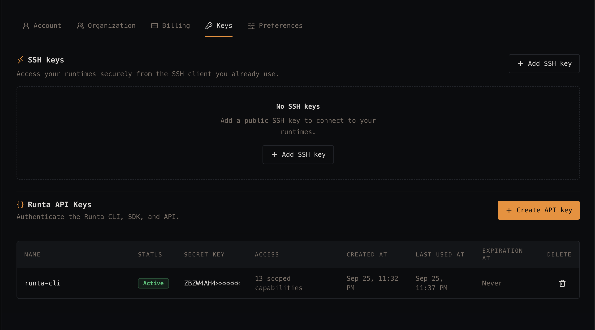

# Audit 05 — Settings → Keys: layout shift on initial load

**Date:** 2026-09-25
**Surface:** Settings → Keys (SSH keys + Runta API Keys)
**Method:** Manual walkthrough

## Raw notes

> There is quite a bit of layout shift in this page during initial load.

## Observations

### 1. Content jumps around while the page settles
The Keys page visibly reflows during load rather than arriving in its final shape.

### 2. The page has two independently-resolving async sections stacked vertically
SSH keys sits above Runta API Keys, and each depends on its own data. Anything the upper section does after
first paint — growing from nothing into a tall empty state, or from a spinner into a list — displaces
everything below it. With the taller SSH block on top, the API keys table is pushed down by whatever the
SSH section resolves into.

### 3. The states these sections resolve between are very different heights
The SSH empty state is a tall bordered panel with heading, description, and its own button. A populated list
would be a different height again; a loading state different from both. Same for the API keys table, which
goes from nothing to a header row plus n data rows. Unless each container reserves space up front, every
transition between these states is a visible jump.

### 4. Likely contributors worth checking
- Sections rendering `null` (or a short spinner) while loading, then expanding to full height.
- No min-height or skeleton reserving the final footprint of each panel.
- The table rendering its rows only once data arrives, with no placeholder rows.

## Suggested fixes

- **Measure it first:** capture CLS for this route in DevTools (Performance panel, or a Lighthouse run) and
  use the layout-shift regions to confirm which section is actually moving before changing anything.
- **Reserve space with skeletons:** render each panel at its expected height while loading — a skeleton empty
  state for SSH keys, skeleton rows for the API keys table — so resolution swaps content without resizing
  the container.
- **Set min-heights on both section containers** so the difference between loading, empty, and populated
  states doesn't change the page's vertical layout.
- **Fetch both sections' data in parallel** and ideally paint once, rather than letting each section pop in
  independently and shove the other one around.
- **Add CLS to the perf budget** alongside the dashboard load work in [audit 02](./02-dashboard-load-performance.md)
  — both are the same underlying story of the authenticated app feeling unsteady on arrival.

## Open questions

- Which section visibly moves more — SSH keys or the API keys table?
- Does the shift also happen on reload with a warm cache, or only cold?
- Do other settings tabs (Account, Organization, Billing, Preferences) shift the same way? If so this is a
  shared layout/data-loading pattern rather than a Keys-page bug.
