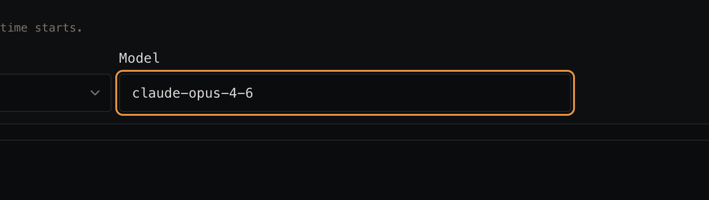

# Audit 06 — Create runtime: Model should be a picker, not a text input

**Date:** 2026-09-26
**Surface:** Create runtime flow → Model field
**Method:** Manual walkthrough

## Raw notes

> In create runtime flow, this should be a model picker instead of an input field we keep updating.

## Observations

### 1. Model is a free-text field
Choosing a model means typing its exact identifier by hand. The user has to already know the string, spell it
correctly, and get the version suffix right — with no list to choose from, no validation, and no indication
of what's actually available. Every other constrained choice on this form is a dropdown; the model is the one
place the user is asked to recall an identifier from memory.

### 2. The set of valid models is maintained by hand
Because the field is free text, the list of supported models lives wherever it was last written down —
defaults in code, docs, and whatever the user typed before. Every time a provider ships or retires a model,
that value has to be chased and updated by hand, and stale identifiers persist in saved runtimes.

## Suggested fixes

- **Replace the input with a model picker** — a select/combobox listing the models Runta supports, matching
  the dropdown pattern already used elsewhere on this form.
- **Source the list from one place** so new and retired models flow through without hand-editing a text value
  in each spot it appears.
- **Keep the picker searchable** (type-to-filter) so the list stays usable as the number of models grows, and
  power users who know the identifier can still type it.
- **Show enough to choose by** — group by provider, and surface the detail that distinguishes one model from
  another so the choice doesn't require outside knowledge.

## Open questions

- Is the supported model list fixed by Runta, or can users bring an arbitrary model identifier? If arbitrary
  values must stay possible, a combobox with a free-text escape hatch fits better than a strict select.
- Should the picker reflect models the user's own account/provider keys have access to, rather than every
  model Runta knows about?
