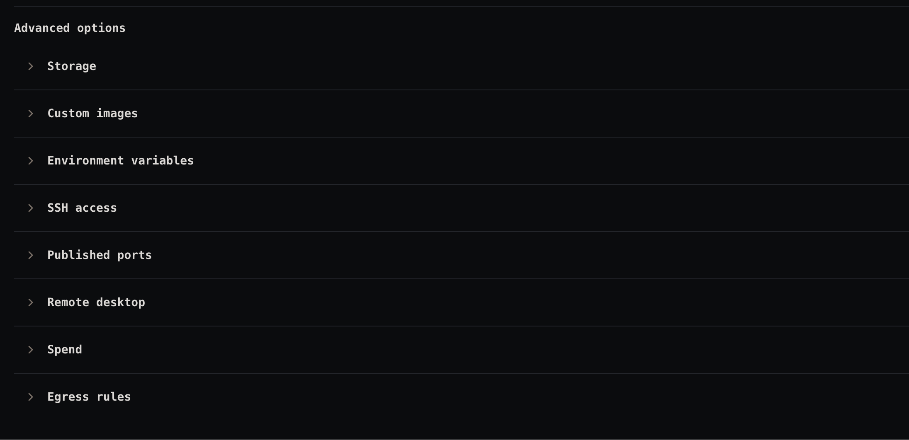

# Audit 07 — Create runtime: Advanced options need icons

**Date:** 2026-09-26
**Surface:** Create runtime flow → Advanced options
**Method:** Manual walkthrough

## Raw notes

> Should give icons to these options in create so it's easier for repeated users to navigate.

## Observations

### 1. Eight collapsed sections that look identical
Storage, Custom images, Environment variables, SSH access, Published ports, Remote desktop, Spend, and Egress
rules are presented as a uniform stack — same chevron, same type, same weight, same spacing. The only thing
distinguishing one row from another is the label text, so every visit means reading down the list.

### 2. The cost lands on repeat users
Someone creating their first runtime reads the whole list anyway. Someone creating their tenth already knows
they want Environment variables — but still has to scan eight near-identical rows to find it, every time.
Icons give each row a distinct shape that can be recognised at a glance instead of read, which is what makes
a frequently-used list fast.

## Suggested fixes

- **Add a distinct icon to each Advanced option**, leading the row before the label, so the eight sections
  become visually distinguishable at a glance.
- **Pick icons that map to the concept** — a disk for Storage, a key for SSH access, a terminal/box for Custom
  images, and so on — so the shape carries meaning rather than just adding colour.
- **Keep them consistent with the icons already used elsewhere** in the product (the settings tabs and section
  headers already pair an icon with a label), so the same concept reads the same way across screens.

## Open questions

- Is there an existing icon set in the design system to draw from, or does one need choosing?
