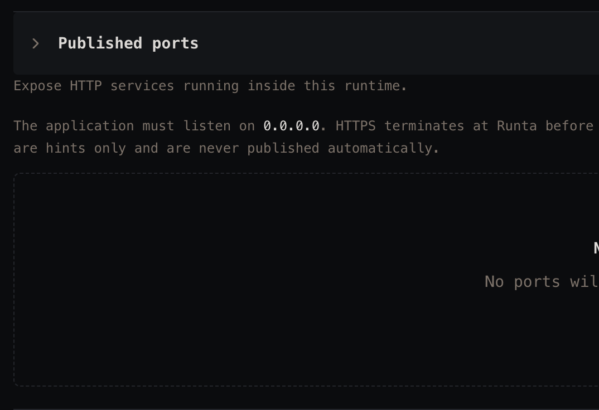

# Audit 08 — Create runtime: padding in expanded Advanced options

**Date:** 2026-09-26
**Surface:** Create runtime → Advanced options → Published ports (expanded)
**Method:** Manual walkthrough

## Raw notes

> Visual feedback, the paddings are off.

## Observations

### 1. Section header and its body don't share a left edge
The "Published ports" header sits inset — chevron first, then the label — while the description text and the
dashed panel below it start noticeably further left, close to the container edge. The header and the content
it belongs to are on two different left margins, so the section reads as two unrelated blocks instead of one.

### 2. Header and body have very different vertical padding
The header row is generously padded above and below, then the description starts immediately under the
divider with almost no breathing room. The jump from loose to tight is abrupt, and the body text ends up
crowding the rule above it.

### 3. The dashed empty-state panel is disproportionately tall
The empty state reserves far more height than its single line of content needs, leaving a large void inside
the dashed border. Against the tight spacing directly above it, the section's vertical rhythm swings from
cramped to empty with nothing in between.

## Suggested fixes

- **Align the section body to the header label**, so the description, the dashed panel, and the header text
  share one left edge — or inset all of them equally, but pick one and apply it consistently.
- **Even out the vertical padding**: give the description room below the header divider rather than letting it
  butt against the rule, and keep the step between header and body consistent with the other sections.
- **Size the empty-state panel to its content** — a smaller minimum height, with the message optically centred
  — so it doesn't open a void in the middle of the form.
- **Apply the same pass to every Advanced option**, since these sections almost certainly share one component
  and one set of spacing values.

## Open questions

- Do the other Advanced options (Storage, Environment variables, SSH access, …) show the same misalignment
  when expanded?
